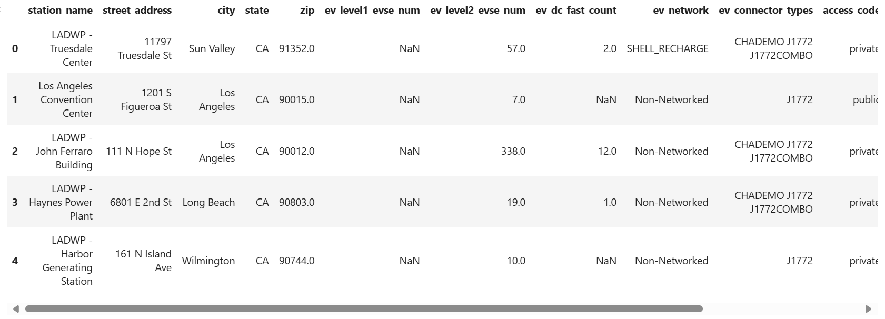
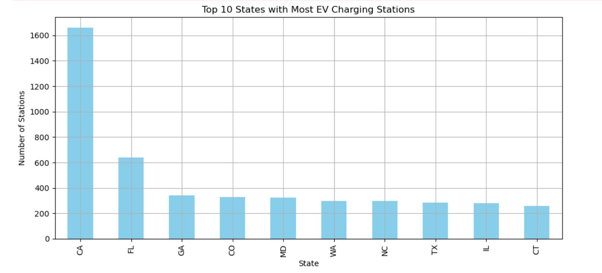
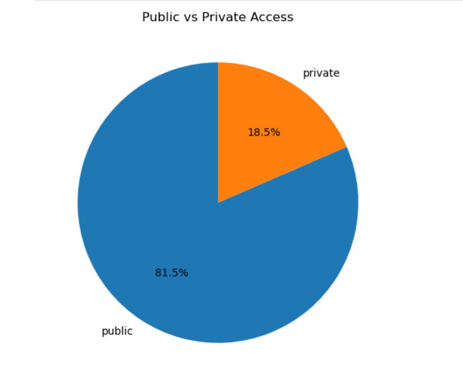
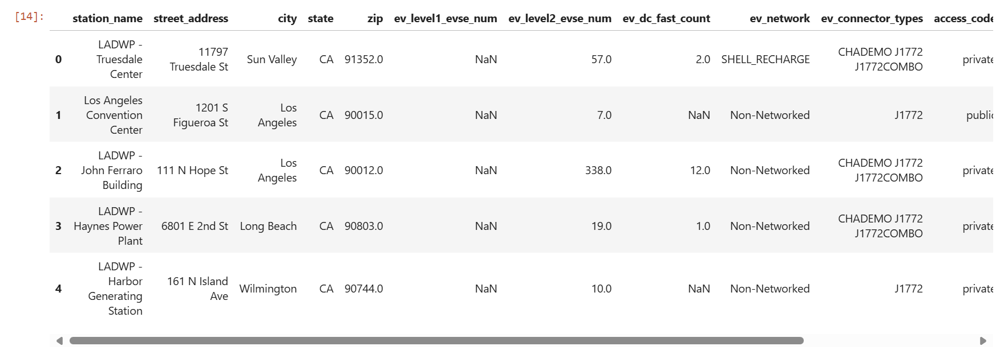
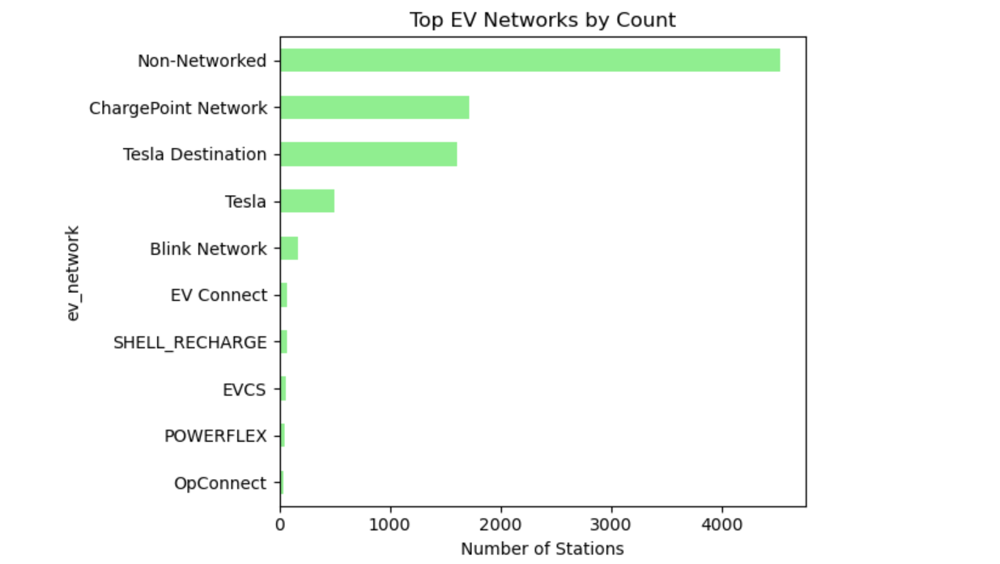

# ev-charging-analytics
Data analytics project on EV charging station growth using SQL, Python, and Tableau.

# ⚡ ev-charging-analytics

## Analyzing Growth Trends of EV Charging Stations Across the U.S. Using Python and Tableau

- **Python (Pandas, Matplotlib)**
- **Tableau** for dashboarding
- **GitHub** for collaboration and hosting

---

## 📊 Visualizations

### 🔟 Top 10 States with Most EV Stations  

### ☘️ Public vs Private Access Types  

### 🏙️ EV Network Usage Distribution  

### 📊 Tableau Dashboard Preview  

## 📊 Map View 

---

## 📁 Files & Structure

---

## 📌 Key Takeaways

- Extracted trends from public datasets using Python
- Cleaned, visualized, and exported data for Tableau dashboards
- Demonstrated storytelling with data visualizations

---

## 🔗 Author

**Namrata Patil**  
[LinkedIn](https://www.linkedin.com/in/patil1namrata)  
📍 Buffalo, NY
